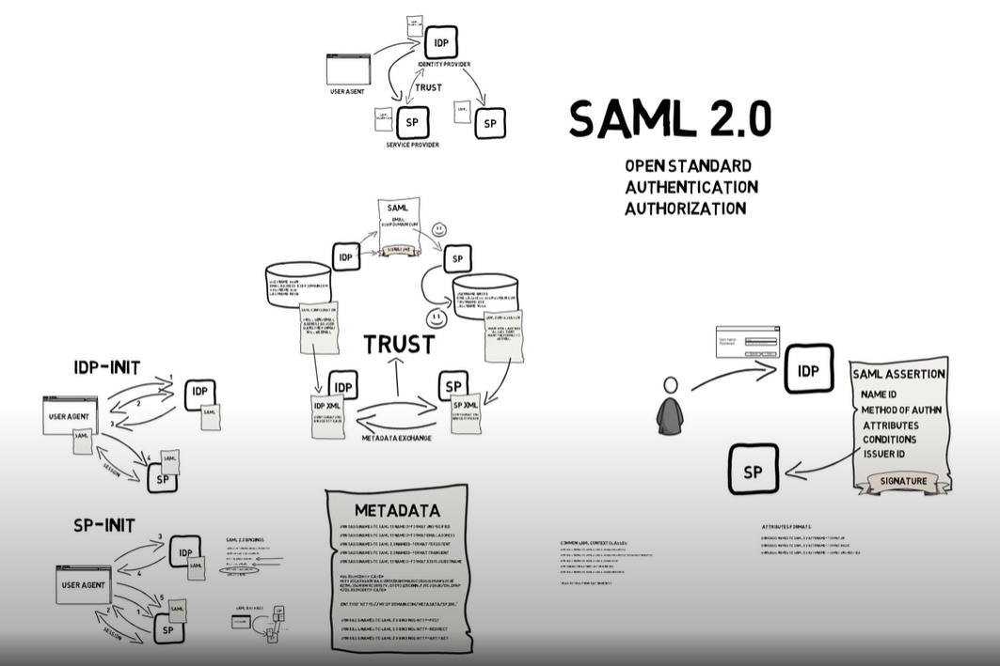

## There are several types of authentication protocols, some of the most common ones are:

1. Password-based authentication: This is the most common type of authentication, where a user provides a username and password to access a system or service.

1. Biometric authentication: Biometric authentication uses a person's unique physical characteristics, such as fingerprints, facial recognition, or iris scans, to verify their identity.

1. Token-based authentication: Token-based authentication involves the use of a physical or digital token, such as a smart card or a one-time password (OTP) sent to a mobile device, to verify a user's identity.

1. Two-factor authentication (2FA): This type of authentication requires two methods of identification, typically a password and a code or token that is sent to a user's mobile device or generated by an authentication app.

1. Multi-factor authentication (MFA): MFA is similar to 2FA, but can use multiple methods of identification, such as biometric authentication, smart cards, or USB tokens.

1. Risk-based authentication: Risk-based authentication uses machine learning and behavioral analytics to evaluate a user's risk level based on their behavior, location, device, and other factors, and then applies appropriate authentication measures.

1. Certificate-based authentication: In this type of authentication, a digital certificate is used to authenticate a user's identity. The certificate is issued by a trusted third party, and the user presents it to the system or service to gain access.

1. Kerberos authentication: Kerberos is a network authentication protocol that uses a trusted third party to verify the identity of users and services. It is often used in enterprise environments.

1. Federated authentication: Federated authentication enables users to use their existing login credentials from one system or service to access other systems or services, without having to create new accounts or passwords.

1. Social media authentication: Social media authentication allows users to log in to other systems or services using their social media credentials, such as Facebook or Google.

1. Claim-based authentication: Claim-based authentication uses a set of claims or attributes about a user to determine their identity and level of access.

1. OAuth authentication: OAuth is an authentication protocol that enables users to grant access to their resources on one site to another site without giving away their password. It is commonly used by social media sites and other web applications.

1. OpenID Connect authentication: OpenID Connect is an authentication protocol that enables users to authenticate to multiple applications using a single set of credentials. It is based on the OAuth 2.0 protocol and is commonly used in web applications.

# Time Line

## SAML (Claim-based authentication)
SAML (Security Assertion Markup Language) is an XML-based open standard for exchanging authentication and authorization data between parties, particularly between an identity provider (IdP) and a service provider (SP). It enables single sign-on (SSO) across multiple systems and applications, allowing users to authenticate once and access multiple services without having to provide their credentials each time.
Roots in single sign-on for browser-based application
**Provides both authentication and authorization**

Here's a brief overview of how SAML works:

1. A user attempts to access a protected resource on a service provider's system.
1. The service provider sends a SAML request to the identity provider, asking for authentication of the user.
1. The identity provider authenticates the user, creates a SAML response containing information about the user and their authorization, and sends it back to the service provider.
1. The service provider verifies the SAML response, grants access to the protected resource, and establishes a session for the user.

SAML defines three main components: the Assertion, the Request, and the Response.

1. Assertion: This is an XML document containing information about a user's identity and authorization that is digitally signed by the identity provider. The assertion is sent by the identity provider to the service provider in response to a SAML request.

1. Request: This is an XML document sent by the service provider to the identity provider, requesting authentication and authorization information for a user.

1. Response: This is an XML document sent by the identity provider to the service provider in response to a SAML request, containing the user's identity and authorization information.

## OAuth 2.0
OAuth 2.0 is an authorization framework that enables third-party applications to access protected resources on behalf of a user without requiring the user's credentials. Not for authentication, Not really authorization, **Delegate Authority**

Access Tokens: OAuth 2.0 uses access tokens to grant access to protected resources. These tokens are issued by an authorization server and are used by client applications to access resources on behalf of a user. It will be a string, but for OAuth 2.0 there is no standard formate for this token. So user can use different kind of token formate like 
    1. WS-SECURITY TOKEN
    1. SAML TOKENS
    1. JWT TOKENS
    1. LEGACY TOKENS
    1. HOME-GROWN
    1. ORACLE ACCESS MANAGER
    1. SITEMINDER
    1. CUSTOM TOKENS
For this it is complicate to integrate different system

Scopes: OAuth 2.0 uses scopes to specify the level of access that a client application is requesting to a protected resource. Scopes are defined by the resource server and are requested by the client application during the authorization process. So there is no standard about scopes different user add different of scopes for there application. like
    1. PROFILE
    1. CONTRACTS.READ
    1. CONTRACTS.WRITE
    1. XYZ

Flows:
1. Authorization Code Flow: The **most common flow** used in OAuth 2.0 is the authorization code flow. This flow involves the user being redirected to an authorization server to grant access to a client application. The authorization server then issues an authorization code that the client application can exchange for an access token.

1. Implicit Flow: The implicit flow is a simplified version of the authorization code flow that is **designed for client applications** that run in a web browser. In this flow, the authorization server issues an access token directly to the client application, rather than an authorization code.

1. Resource Owner Password Credentials Flow: The resource owner password credentials flow allows a client application to obtain an access token by sending the user's username and password directly to the authorization server. This flow is generally **not recommended** due to security concerns.

1. Client Credentials Flow: The client credentials flow allows a client application to obtain an access token using its own credentials, rather than on behalf of a user. This flow is typically used for **server-to-server authentication**.

Overall, OAuth 2.0 provides a flexible and scalable framework for granting third-party applications access to protected resources. Its modular design allows for a variety of authentication and authorization scenarios, and it is widely used in modern web and mobile applications.

### Authorization Code Flow (Front & Back Chanel)

### Authorization Code Flow (Proof Key for Code Exchange (PKCE))
Why use?
Save from Potential attack: authorization code interception attack

Flow : 
<!--  -->

1. Your app needs to generate a **code_verifier** (string of 43 - 128 characters / is a text like password or random text) 
    1. remember this as part of the session! 
1. Use that **code_verifier** to generate a **code_challenge** 
    1. code_challenge = SHA256(code_verifier) // S256 
    1. code_challenge = code_verifier // PLAIN, not recommended 
1. Include **code_challenge** and **code_challenge_method** in authorization request: 
    1. GET /authorize?client_id=...&scope=„Sresponse_type=code&redirect_uri=customURL &code challenge=base64url(code_challenge)&code_challenge_method=S256 
1. Include code_verifier in token exchange request: 
    1. POST /token client_id=...&redirect_uri=...&code=acode&code_verifier=yerifier 

After step 3 when redirect form auth server to app it could be launch in Hacker app for same name and will try to execute step 4, To verify step 4 come form actual app it's need to pass **code_verifier** and auth server check with **code_challenge** by **code_challenge_method** that is already sent to auth server in step 3 for this request process. Hacker app do not know the actual **code_verifier** so step 4 do not return token.

#### OAuth Vs OAuth 2.0
OAuth (Open Authorization) and OAuth 2.0 are both open standards for authorization that enable third-party applications to access protected resources on behalf of a user without requiring the user's credentials. However, there are some key differences between the two versions.

Here are some of the main differences between OAuth and OAuth 2.0:

1. Architecture: OAuth 1.0 uses a signature-based architecture, while OAuth 2.0 uses a token-based architecture. In OAuth 1.0, a client application must sign each request with a shared secret key, while in OAuth 2.0, a client application obtains an access token from an authorization server that can be used to access protected resources.

1. Simplicity: OAuth 2.0 is generally considered to be simpler and more streamlined than OAuth 1.0. OAuth 2.0 simplifies the process of obtaining authorization and accessing protected resources, and provides better support for mobile and web-based applications.

1. Security: OAuth 2.0 provides better security features than OAuth 1.0, including support for SSL/TLS encryption and better protection against cross-site request forgery (CSRF) attacks.

1. Backward Compatibility: OAuth 2.0 is not backward compatible with OAuth 1.0. This means that client applications that were designed to work with OAuth 1.0 may need to be modified in order to work with OAuth 2.0.

1. Scopes: In OAuth 2.0, scopes are used to specify the level of access that a client application is requesting to a protected resource. Scopes were not present in OAuth 1.0.

Overall, OAuth 2.0 is considered to be an improvement over OAuth 1.0, providing better security features, simpler architecture, and better support for modern web and mobile applications.

#### SAML Vs OAuth 2.0
SAML (Security Assertion Markup Language) and OAuth 2.0 are both protocols used for authentication and authorization, but they serve different purposes and are used in different contexts. Here are the main differences between SAML and OAuth 2.0:

1. Purpose: SAML is primarily used for single sign-on (SSO) authentication, where a user is authenticated once and then granted access to multiple systems or applications. OAuth 2.0 is primarily used for authorization, where a user grants permission to a third-party application to access their protected resources (such as their data or social media profile).

1. Architecture: SAML uses a centralized model, where a single identity provider (IdP) is responsible for authenticating users and providing access to resources. OAuth 2.0 uses a distributed model, where users grant permission to client applications to access their resources, without the need for a centralized identity provider.

1. Token Format: SAML uses Security Assertion Markup Language (SAML) tokens to represent user identities and attributes. OAuth 2.0 uses access tokens to grant permission to client applications to access protected resources.

1. Transport Protocol: SAML typically uses SOAP (Simple Object Access Protocol) over HTTP or HTTPS for communication between the identity provider and service providers. OAuth 2.0 uses REST (Representational State Transfer) over HTTP or HTTPS for communication between the client application and the authorization server.

1. User Experience: SAML provides a seamless SSO experience for users, allowing them to access multiple systems or applications without having to repeatedly enter their credentials. OAuth 2.0 requires users to explicitly grant permission to client applications to access their resources, which can result in a more transparent and granular user experience.

Overall, SAML and OAuth 2.0 are different protocols with different use cases, and they can be used together to provide a more complete authentication and authorization solution. SAML is more suitable for SSO scenarios, while OAuth 2.0 is more suitable for authorization scenarios in which users grant permission to third-party applications to access their protected resources.

## OpenID Connect (OIDC):
It's come to make standard **Token** and **Scope** of OAuth 2.0, It's a wrapper of OAuth 2.0. It's should have 
1. ID-Token with JWT
1. UserInfo Endpoint
1. OpenId Connect Discovery

Flow:

