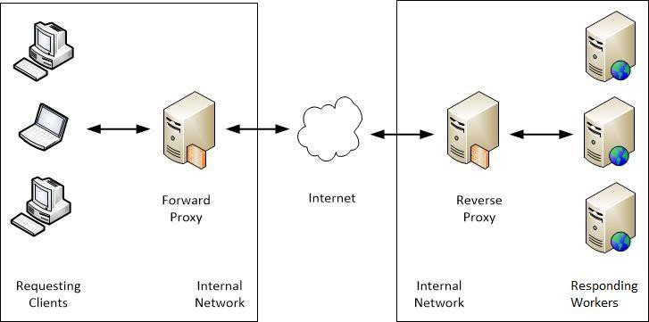
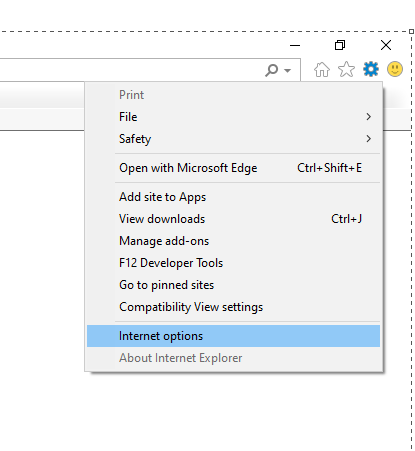
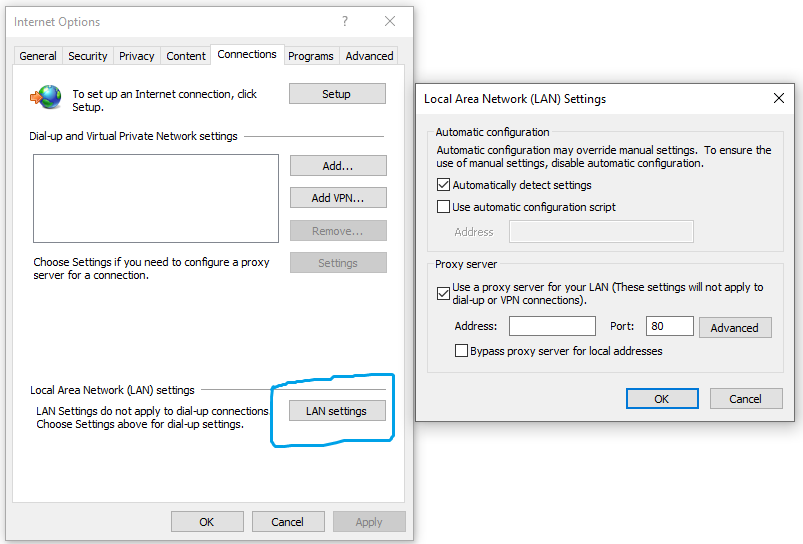

# Introduction

# Proxy Setup using Browser
1. 
1. 

# Configure in WebConfig
1. For default proxy

    ```
    <system.net>  
    <defaultProxy>  
      <proxy usesystemdefault="true" />
    </defaultProxy>  
    </system.net> 
    ```
1. For bypass proxy
    
    
    ```
    <system.net>  
        <defaultProxy>  
            <proxy  proxyaddress="http://proxy.contoso.com:3128"  
                    bypassonlocal="True"  
            />  
            <bypasslist>  
                <add address="[a-z]+\.blueyonderairlines\.com$" />  
            </bypasslist>  
        </defaultProxy>  
    </system.net>  
    ```
    
    ```
    <system.net>
        <defaultProxy>
                <proxy autoDetect="false" bypassonlocal="true" proxyaddress="http://proxy_host:8080" />
        </defaultProxy>
    </system.net>
    ```
1. Using c#
    ```c#
    using System.Net;
    using System.Net.Http;

    var webProxy = new WebProxy(
        new Uri("ProxyUri"), 
        BypassOnLocal: false);

    serviceCollection
    .AddHttpClient("ProxiedClient")
    .ConfigurePrimaryHttpMessageHandler(() => new HttpClientHandler() { 
        Proxy = webProxy, // if we want to use default proxy then set Proxy = null
        UseProxy = true 
    });
    ```

Reference: [1](https://docs.microsoft.com/en-us/dotnet/framework/network-programming/proxy-configuration)
[2](https://docs.blackberry.com/en/id-comm-collab/blackberry-athoc/blackberry-athoc/7_9/install/post-install-upgrade-config/configure-net-framework-web-proxy)
[3](https://stackoverflow.com/questions/52526095/how-to-configure-web-proxy-for-httpclient-created-directly-via-httpclientfactory)
[4](http://blog.marcinchwedczuk.pl/dotnet-core-http-client-proxy-and-localhost)
[5](https://tech.scottalex.com/net-core-2-with-proxies/)