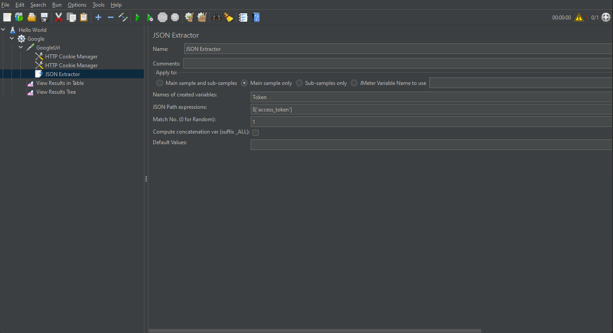

# JMeter
The Apache JMeter™ application is open source software, a 100% pure Java application designed to load test functional behavior and measure performance. It was originally designed for testing Web Applications but has since expanded to other test functions.

## Install
1. Install Java
    - Because JMeter is pure Java desktop application, it requires a fully compliant JVM 6 or higher. You can download and install the latest version of **Java SE Development Kit**. [Download Java Platform (JDK)](https://www.oracle.com/java/technologies/javase-downloads.html). [_Download_](https://download.oracle.com/java/18/latest/jdk-18_windows-x64_bin.exe)
1. Download JMeter
    - [Download Latest JMeter](https://jmeter.apache.org/download_jmeter.cgi) Choose the Binaries file (either zip or tgz) to download as shown in the figure below.
    
    -Extract this .zip file
1. Run JMeter
    - Run this file `apache-jmeter-5.5\bin\jmeter.bat` from Extract folder then _JMeter_ will open.
    

## Example
### Hello World

https://www.youtube.com/watch?v=T-bTll7IRL0

## Set User Defined Variables

Use This variable by `${variable}` in other place, like **HTTP Header Manager**, **HTTP Cookie Manager** etc.

## HTTP Header Manager

## HTTP Cookie Manager

### HTTP Cookie for all request and automatically set
we can use it in thread level

## JSON Extractor (Get access token)

Then add **User Defined Variables**  *Token*
