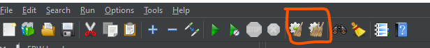

# JMeter
The Apache JMeter™ application is open source software, a 100% pure Java application designed to load test functional behavior and measure performance. It was originally designed for testing Web Applications but has since expanded to other test functions.

## Install
1. Install Java
    - Because JMeter is pure Java desktop application, it requires a fully compliant JVM 6 or higher. You can download and install the latest version of **Java SE Development Kit**. [Download Java Platform (JDK)](https://www.oracle.com/java/technologies/javase-downloads.html). [_Download_](https://download.oracle.com/java/18/latest/jdk-18_windows-x64_bin.exe)
1. Download JMeter
    - [Download Latest JMeter](https://jmeter.apache.org/download_jmeter.cgi) Choose the Binaries file (either zip or tgz) to download as shown in the figure below.
    
    -Extract this .zip file
1. Run JMeter
    - Run this file `apache-jmeter-5.5\bin\jmeter.bat` from Extract folder then _JMeter_ will open.
    

## Example
### Hello World

https://www.youtube.com/watch?v=T-bTll7IRL0

## Set User Defined Variables

Use This variable by `${variable}` in other place, like **HTTP Header Manager**, **HTTP Cookie Manager** etc.

## HTTP Header Manager

## HTTP Cookie Manager

### HTTP Cookie for all request and set automatically
we can use it in thread level and update **apache-jmeter-5.5\bin\jmeter.properties** `CookieManager.save.cookies=true`

## JSON Extractor (Get access token)

Then add **User Defined Variables**  *Token*

## JSR223 PostProcessor (**!Important**)
- It will run after all redirect done

## Assertions
|TYPE | USAGE|
|-----|------|
|Response Assertion |	Apply a string pattern to verify against the server response|
|Duration Assertion |	Check the response was received within a given elapsed time|
|Size Assertion |	Check the size of the server response contains the wanted number of bytes|
|XML Assertion |	Check the response is a valid XML document|
|Beanshell Assertion |	Execute your own logic using Beanshell scripting|
|MD5Hex Assertion |	Allows to check the MD5 hash of the response data (great for static files)|
|HTML Assertion |	Check html response syntax using JTidy|
|XPath Assertion |	Tests if a document is well-formed, with possible DTD validation, or putting the document through JTidy and testing with XPath |
|XML Shema Assertion |	Validate an XML response against an XML schema|
|JSR223 Assertion |	Run your own code logic using a JSR223 Script|
|Compare Assertion |	Compares results between themselves|
|SMIME Assertion |	Evaluate the sample results from the Mail Reader Sampler|
|JSON Assertion |	Execute JsonPath expressions and validate Json documents|

## Assertions Performance
|ASSERTION |	CPU/MEMORY USAGE |	NOTES|
|----------|---------------------|-------|
|Response Assertion |	Moderate |	Regular Expressions|
|Duration Assertion |	Low |	|
|Size Assertion |	Low |	|
|XML Assertion |	High |	Builds XML DOM Documents|
|Beanshell Assertion |	Variable |	Depends on the script logic|
|MD5Hex Assertion |	Low |	|
|HTML Assertion |	High |	Parses the HTML Response|
|XPath Assertion |	High |	Builds XML DOM Documents|
|XML Schema | Assertion |	High	Builds XML DOM Documents|
|JSR223 Assertion |	Variable |	Depends on the script logic|
|Compare Assertion |	High |	Parses responses and compares them|
|SMIME Assertion |	Moderate |	|
|Json Assertion |	High |	Parses the Json document|

## Data Extract
### BeanShell Preprocessor

### CSS Selector Extractor

- Select data from html by css selector
- Set Attribute for get value
- Set data in variable for future use

- Crete Multiple Selector for multiple value

### BeanShell PostProcessor
- Get value from User Defined Variables

### Response Assertion

- Status Code Check

### Thread Group

### Overcoming HTTPS Socket Errors in JMeter
1. Use latest version of JMeter
    - It is highly recommended to use the most recent version, to leverage new improvements and components. Avoid using versions that are older than 3 versions before the last one.
1. Enable DEBUG mode in JMeter
    - Options -> Log Level -> DEBUG
1. Set Connection timeout
    - The default connection timeout in JMeter is 20 seconds out-of-the-box. To help diagnose and resolve socket connection issues, it is often helpful to increase this value. To do so, specify a higher connection timeout the HTTP Request object in your JMeter test plan. For example, set to 60000 (milliseconds) to increase the overall timeout to 60 seconds.

    - Add a ‘HTTP Request Default’ configuration element from the ‘Configuration Elements’ option (i.e., Right-click test plan and add this ‘HTTP Request Default’).

1. Delay Thread Creation
    - JMeter has an option to delay thread creation until the thread starts sampling (i.e., after any thread group delay and the ramp-up time for the thread itself). This allows for a very large total number of threads, provided that not too many are active concurrently.

1. Disable Parallel Downloads

1. Enable HTTP Keep-Alive on web servers
    - Keep-Alive is very important feature of HTTP protocol. It allows the client to make several HTTP requests over single TCP connection. This provides a great performance gain, since otherwise establishing many TCP connections will produce a lot of unnecessary networking overhead.

## Clean data

## Off Execution

[r1](https://octoperf.com/blog/2018/04/19/jmeter-assertions/#supported-assertions)
