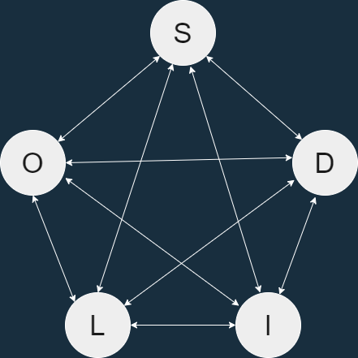

# SOLID Principle
**SOLID** is an acronym for the first five object-oriented design (OOD) principles by Robert C. Martin in the 1990s, People call by **SOLID** principles. 

SOLID is the popular sets of design principles in object-oriented software development.
<br>

### SOLID stands for
- S - [Single-responsibility Principle](#single-responsibility-principle)
- O - [Open-closed Principle](#open-closed-principle)
- L - [Liskov Substitution Principle](#liskov-substitution-principle)
- I - [Interface Segregation Principle](#interface-segregation-principle)
- D - [Dependency Inversion Principle](#dependency-inversion-principle)
<br>

We do not always write OO(object-oriented) code using OO language. Because sometime we write procedural code using OO language. That means OO language does not guarantee OO code. We can make our code OO by applying **SOLID** principles.
<br>

## What it is?
1. Reaction (Solution) of [**Design smell**](#design-smell)

### Design smell
1. Rigidity
    - The design is *difficult to change*. (when new requirement come event design is good).
1. Fragility
    - The design is *easy to break*. (If our architecture is good a new developer break our code.)
1. Immobility
    - The design is *difficult ot reuse*
1. Viscosity
    - It's difficult to *do the right thing*.
1. Needless complexity
    - Over design. (Every thing want to make generic)

## What **SOLID** is not
1. **Not** a framework
1. **Not** a library
1. **Not** a pattern
1. **Not** a specifics technology
1. **Not** a technology bound
1. ***Not a goal***

## **Why** we wants to write **SOLID** code?
1. More productive by making code more maintainable.
1. When we write code this is not final code event though we think we write code by getting all requirement. Requirement change always so we have to change our code.
1. To make our code Supple so that we can easily change the shape of our code when requirement change .
1. To pulling our code to OO design.

## Where we can apply
1. In Different technology Like (c#, Jave, Php ...)

## What is our Goal
1. Go toward to SOLID.
1. Go more closer to SOLID. Make it more SOLID.
1. Decomposition and decoupling.
1. Do not make it goal.
1. All principles closely coupled. They are inter dependant. Only when we apply all principles then we can go closer to **SOLID**. A single principle is not applicable for **SOLID**.


---
## Single-responsibility Principle
**There should never be more than one reason for a class to change**. In other words, every class should have only one responsibility. [Robert C. "Uncle Bob" Martin - wiki](https://en.wikipedia.org/wiki/SOLID)
- Separate of concerns
- Each class Should *Do one thing, and **do it well***
- Just because you *can*, Doesn't mean you *should*.

- Zoom your code one to one
- Code according to Context
- Each concrete class is very specific
- Low **Coupling** and high **Cohesion**
    - Cohesion: how strongly-related and focused are the various responsibilities **of a module**
    - Coupling: the degree to which each program module relies on each one of the other modules
- Responsibilities are Axes of Change
    - Requirements change typically map to responsibilities
    - More responsibilities == More likelihood of change
    - Having multiple responsibilities with a class, couples together these responsibilities
    - **The more classes a change affects, the more likely the change will introduce error**.

## Example [[r1](https://exceptionnotfound.net/simply-solid-the-single-responsibility-principle/)]

:x:
```c#
public class InvitationService
{
	public void SendInvite(string email, string firstName, string lastName)
    {
    	if(String.IsNullOrWhiteSpace(firstName) || String.IsNullOrWhiteSpace(lastName))
        {
         	throw new Exception("Name is not valid!");
        }
    	
    	if(!email.Contains("@") || !email.Contains("."))
        {
        	throw new Exception("Email is not valid!!");
        }
        SmtpClient client = new SmtpClient();
        client.Send(new MailMessage("mysite@nowhere.com", email) { Subject = "Please join me at my party!" });
    }
}
```

:heavy_check_mark:
```c#
public class InvitationService
{
    UserNameService _userNameService;
    EmailService _emailService;

    public InvitationService(UserNameService userNameService, EmailService emailService)
    {
        _userNameService = userNameService;
        _emailService = emailService;
    }
    public void SendInvite(string email, string firstName, string lastName)
    {
        _userNameService.Validate(firstName, lastName); // Do you think same think is doing hare? No it's only call other who has responsibility to validate.
        _emailService.Validate(email);
        SmtpClient client = new SmtpClient();
        client.Send(new MailMessage("sitename@invites2you.com", email) { Subject = "Please join me at my party!" });
    }
}

public class UserNameService
{
    public void Validate(string firstName, string lastName)
    {
        if(String.IsNullOrWhiteSpace(firstName) || String.IsNullOrWhiteSpace(lastName))
        {
            throw new Exception("The name is invalid!");
        }
    }
}

public class EmailService
{
    public void Validate(string email)
    {
        if (!email.Contains("@") || !email.Contains("."))
        {
            throw new Exception("Email is not valid!!");
        }
    }
}
```

---    
## Open-closed Principle
Software entities (classes, modules, functions, etc...) should be open for extension, but closed for modification [Wiki]. When other client rely on your class then you are no longer allow to change this class.

- Needless complexity
- Developers have tendency to attempt to solve specific problems with general solutions. This leads to coupling and complexity. Instead of being general, code should be specific. [Greg Young]


### Allow to change
- Bug fixing
- If module change once, accept it.

### Open to Extension
- New behavior can be added in future
    - Rely on abstractions
    - No limit to variety fo implementations of each abstraction
    - In .NET, abstractions include:
        - Interfaces
        - Abstract Base Classes
- When other client rely on.

### When Closed to Modification
- If it change a second time, refactor to achieve
- Changes to source or binary code are not required

### Way?
1. Parameters (Procedural Programming)
    - Allow client to control behavior specifics via parameters
    - Combined with delegates/lambda, can be very powerful approach
1. Inheritance/Template Method Pattern
    - Child type override behavior of a base class (or interface)
1. Composition over inheritance / Strategy Pattern
    - Client code depends on abstraction
    - Provides a "plug in" model
    - Implementations utilize Inheritance, Client utilizes Composition

## Example
:x:
```c#
public class CombinedAreaCalculator
{
    public double Area(object[] shapes)
    {
        double area = 0;
        foreach (var shape in shapes)
        {
            if (shape is Rectangle)
            {
                Rectangle rectangle = (Rectangle)shape;
                area += rectangle.Width * rectangle.Height;
            }
        }
        return area;
    }
}

public class Rectangle
{
    public double Width { get; set; }
    public double Height { get; set; }
}
```
What happen for Circle
```c#
public class CombinedAreaCalculator
{
    public double Area(object[] shapes)
    {
        double area = 0;
        foreach (var shape in shapes)
        {
            if (shape is Rectangle) // Violate principle, modify code. condition add
            {
                Rectangle rectangle = (Rectangle)shape;
                area += rectangle.Width * rectangle.Height;
            }
            if (shape is Circle)
            {
                Circle circle = (Circle)shape;
                area += (circle.Radius * circle.Radius) * Math.PI;
            }
        }

        return area;
    }
}
public class Circle
{
    public double Radius { get; set; }
}
```
Violate rule **CombinedAreaCalculator** modify. How we can solve it?. We can solve it by refactor this code so that it flow the principle.

:heavy_check_mark:
```c#
public class CombinedAreaCalculator
{
    public double Area(Shape[] shapes)
    {
        double area = 0;
        foreach (var shape in shapes)
        {
            area += shape.Area(); // Now it's work
        }
        return area;
    }
}

public abstract class Shape
{
    public abstract double Area();
}

public class Rectangle : Shape
{
    public double Width { get; set; }
    public double Height { get; set; }
    public override double Area()
    {
        return Width * Height;
    }
}

public class Circle : Shape
{
    public double Radius { get; set; }
    public override double Area()
    {
        return Radius * Radius * Math.PI;
    }
}

public class Triangle : Shape
{
    public double Height { get; set; }
    public double Width { get; set; }
    public override double Area()
    {
        return Height * Width * 0.5;
    }
}
```

---
## Liskov Substitution Principle
Subtypes must be substitutable for their base types [Robert C. "Uncle Bob" Martin - wiki](https://en.wikipedia.org/wiki/SOLID).

### How Find
- Subtype IS A Base type
    - Duck IS A Bird
        - **`Example: Bird = Duck`**
- Subtype IS SUBSTITUTABLE FOR Base type


### Condition
- Subtype must have all property of Base type.
- Subtype can not violate base type.

### Example
:heavy_check_mark:
```C#
public class Bird {
    public void fly(){}
}
public class Duck extends Bird {
    // Duck can fly that means Duck has all property that are exist for a bird, So it is valid
}
```

:x:
```C#
public class Bird {
    public void fly(){}
}
public class Penguin extends Bird {
    // Penguin can not fly, 
    // So Penguin has not all property that are exist for a bird
    // extends Bird is invalid
}
```
---
## Interface Segregation Principle
The Interface Segregation Principle states that Clients should **not** be forced to **depend** on methods they do **not use**.
- Prefer small, cohesive interfaces to “fat” interfaces
    - To reduce more complexity (Configurations)


### How
- Keep interfaces small, cohesive, and focused
- Whenever possible, let the client define the interface according to the requirement
- Client use interface according to there requirement.
    - If one Implementation from different **interface**, client will use it according to there requirement.

### Problem if do not apply
- Increasing complexity
- Increasing coupling
- Reducing flexibility
- Reducing Maintainability

### When refactor
- Once there is pain
    - If there is no pain, there’s no problem to address.
- If you find **fat** interfaces are problematic

### Example
:x:
```c#
public interface IVehicle
{
    void Drive();
    void Fly();
}

public class MultiFunctionalCar : IVehicle
{
    public void Drive()
    {
        //actions to start driving car
        Console.WriteLine("Drive a multifunctional car");
    }

    public void Fly()
    {
        //actions to start flying
        Console.WriteLine("Fly a multifunctional car");
    }
}

public class Car : IVehicle
{
    public void Drive()
    {
        //actions to drive a car
        Console.WriteLine("Driving a car");
    }

    public void Fly()
    {
        throw new NotImplementedException();
    }
}

public class Airplane : IVehicle
{
    public void Drive()
    {
        throw new NotImplementedException();
    }

    public void Fly()
    {
        //actions to fly a plane
        Console.WriteLine("Flying a plane");
    }
}

// Client
public class DriveCar
{
    private readonly ICar _car;
    public DriveCar(ICar car)
    {
        _car = car;
    }

    public void Drive()
    {
        _car.Drive(); // Problem is there is two option to call 1. Drive(), 2.Fly() but user have to know Fly() is not implemented for Car this is problem.
    }
}

```

:heavy_check_mark:
```c#
public interface ICar
{
    void Drive();
}
public interface IAirplane
{
    void Fly();
}

public interface IMultiFunctionalVehicle : ICar, IAirplane
{
}

public class Car : ICar
{
    public void Drive()
    {
        //actions to drive a car
        Console.WriteLine("Driving a car");
    }
}
public class Airplane : IAirplane
{
    public void Fly()
    {
        //actions to fly a plane
        Console.WriteLine("Flying a plane");
    }
}

public class MultiFunctionalCar : IMultiFunctionalVehicle
{
    public void Drive()
    {
        //actions to start driving car
        Console.WriteLine("Drive a multifunctional car");
    }

    public void Fly()
    {
        //actions to start flying
        Console.WriteLine("Fly a multifunctional car");
    }
}

// Client
public class DriveCar
{
    private readonly ICar _car;
    public DriveCar(ICar car)
    {
        _car = car;
    }

    public void Drive()
    {
        _car.Drive(); // Now there is one option in interface
    }
}
```
---
## Dependency Inversion Principle
High-level modules should not depend on low-level modules. Both should **depend on abstractions**.
<br>
**Abstractions** should not depend on **details**. Details should depend on abstractions.


In the above image `Lamp is a High-level module and electrical wire is low-level module`

### Way
#### Dependency Injection
- Dependency Injection is a technique that is used to allow calling code to inject the dependencies a class needs when it is instantiated
- The Hollywood Principle
    - Don’t call us; we’ll call you
- Three Primary Techniques
    - Constructor Injection
        - Pros
            - Classes self-document what they need to perform their work
            - Works well with or without a container
            - Classes are always in a valid state once constructed
        - Cons
            - Constructors can have many parameters/dependencies (design smell)
            - Some features may require a default constructor
    - Property Injection / Also known as setter injection
        - Pros
            - Dependency can be changed at any time during object lifetime
            - Very flexible
        - Cons
            - Objects may be in an invalid state between construction and setting of dependencies via setters
    - Parameter Injection
        - Pros
            - Very flexible
            - Requires no change to rest of class
        - Cons
            - Breaks method signature
            - Can result in many parameters (design smell)
        - Consider if only one method has the dependency, otherwise prefer constructor injection
- ...

### Example
:x:
```c#
public class Notification
{
    private Email _email;
    private SMS _sms;
    public Notification()
    {
        _email = new Email();
        _sms = new SMS();
    }

    public void Send()
    {
        _email.SendEmail();
        _sms.SendSMS();
    }
}

public class Email
{
    public string ToAddress { get; set; }
    public string Subject { get; set; }
    public string Content { get; set; }
    public void SendEmail()
    {
        //Send email
    }
}

public class SMS
{
    public string PhoneNumber { get; set; }
    public string Message { get; set; }
    public void SendSMS()
    {
        //Send sms
    }
}
```

:heavy_check_mark:
```c#
public class Notification
{
    private ICollection<IMessage> _messages;

    public Notification(ICollection<IMessage> messages)
    {
        this._messages = messages;
    }
    public void Send()
    {
        foreach(var message in _messages)
        {
            message.SendMessage();
        }
    }
}

public interface IMessage
{
    void SendMessage();
}

public class Email : IMessage
{
    public string ToAddress { get; set; }
    public string Subject { get; set; }
    public string Content { get; set; }
    public void SendMessage()
    {
        //Send email
    }
}

public class SMS : IMessage
{
    public string PhoneNumber { get; set; }
    public string Message { get; set; }
    public void SendMessage()
    {
        //Send sms
    }
}
```
---
